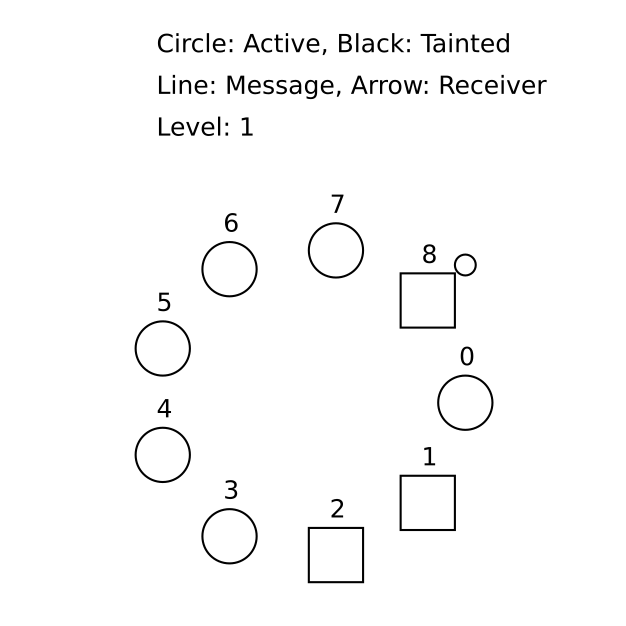
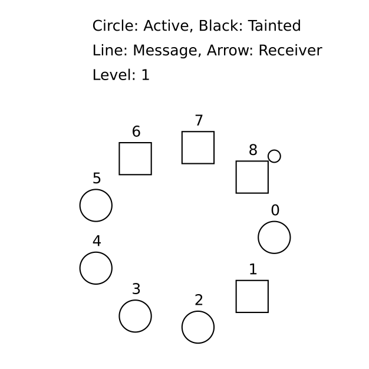
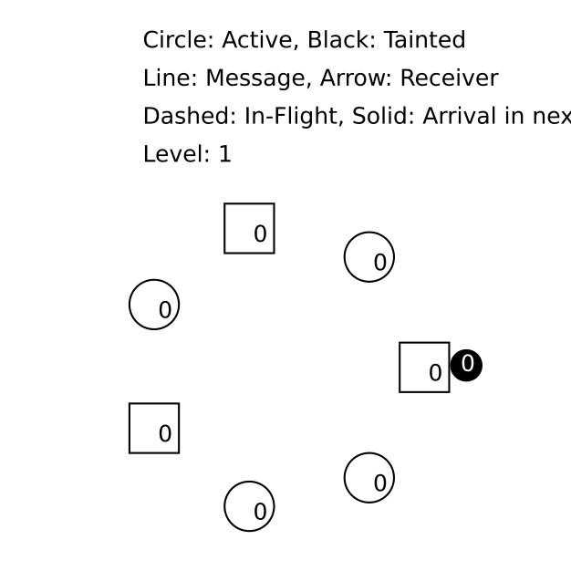

# ewd998
Experience TLA+ in action by specifying distributed termination detection on a ring, [due to Shmuel Safra](https://www.cs.utexas.edu/users/EWD/ewd09xx/EWD998.PDF).  Each [git commit](https://github.com/lemmy/ewd998/commits/) introduces a new TLA+ concept.  Go back to the very first commit to follow along!

### v00: IDE

Click either one of the buttons to launch a zero-install IDE to give the TLA+ specification language a try:

(=> [Screencast how to create the TLA+ Codespace](https://www.youtube.com/watch?v=mFWWDcJahg0&list=PLWLcqZLzY8u_oWnCTGC77OgZlWaab06Gt))

### v01: Problem statement - Termination detection in a ring

#### v01a: Termination of [pleasingly parallel](https://en.wikipedia.org/wiki/Embarrassingly_parallel)

For this tutorial, we assume that the distributed system nodes are organized as a ring, with one the (unique) leader[^1].  If we further assume that nodes execute independent computations, (global) termination detection becomes trivial--the leader initiates a token transfer around the ring, and each node passes the token to its next neighbor, iff the node finished its computation.  When the initiator receives back the token, it knows that all (other) nodes have terminated.

This problem is too simple, and we don't need TLA+ to model it.

[^1] Perhaps by some [leader election algorithm](https://en.wikipedia.org/wiki/Paxos_(computer_science)).

#### v01b: Termination of collaborative computation

A more interesting problem is to look at a "collaborative" computation, which implies that nodes can re-activate each other.  For example, the result of a computation at node 23 is (atomically!) sent to and further processed at node 42. With the previous protocol, node 42 might have already passed on the token, causing the initiator to eventually detect (global) termination; a bug that is at least difficult to reproduce with testing!
A solution is offered in [EWD840](https://github.com/tlaplus/Examples/blob/master/specifications/ewd840/EWD840.tla):
* Initiator sends a "stateful" token around the ring
* Each node remembers if it activated another node
* Activation taints the token (when the activator gets the token)
* Initiator keeps running rounds until it receives an untainted token

#### v01c: Termination detection with asynchronous message delivery

What happens if we loosen the restriction that message delivery is atomic (it seldom is)?  Clearly, we are back at square one:
1) Node 23 sends a message to 42
2) 23 taints the token
3) Initiator starts a new round
4) Node 42 received the fresh token before receiving the activation message from 23
5) Boom!

The fix proposed in [Shmuel Safra's EWD998](https://www.cs.utexas.edu/users/EWD/ewd09xx/EWD998.PDF), is to count in-flight messages. But will this work?

Throughout the chapters of this tutorial, we will use the TLA+ specification language to model EWD998, and check interesting properties.
